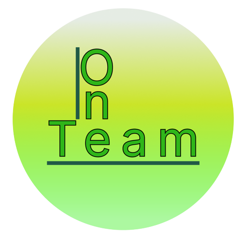

 

##  Information
We created a game where you can protect the world from evil monsters while you are improving your math skills.

##  Demo of our project

    

##    Our team
1. Iva Nedkova - ***Scrum trainer***
   > Email: ***INNedkova21@codingburgas.bg***
   >  
2. Todor Ivanov - ***Back-end Developer***
   > Email: ***TPIvanov21@codingburgas.bg***

3. Bozhidar Dukov - ***Front-end Developer***
   > Email: ***BNDukov21@codingburgas.bg***

4. Valentin Pendashev - ***QA Engineer***
   > Email: ***VBPendashev21@codingburgas.bg***

##  Used technologies
-   C++
-   Visual studio
-   Git Hub
-   Git
-   Power point
-   Word
-   Excel
-   Figma

##  Download
To play our game, you have to clone our repository using this link: https://github.com/codingburgas/2223-9th-grade-sprint-math-games-team-one.git 

##    Rate us
If you like our project, you can rate us by clicking the &#11088; button.
Thank you! 😉
